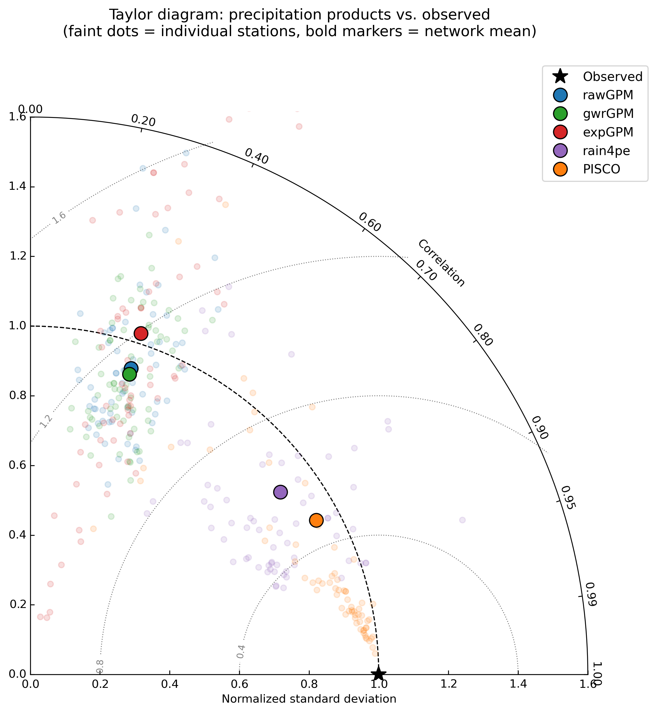

<h2>Evaluating Precipitation Datasets in the Andes of Peru</h2>
<h4>Data Sources:</h4>
<ul>
  <li>ANA (Autoridad Nacional del Agua) – Ground-based stations</li>
  <li>PISCO – High-resolution gridded precipitation dataset</li>
  <li>RAIN4PE – Rainfall estimates for Peru</li>
  <li>GPM – NASA's Global Precipitation Measurement</li>
  <li>GPM Downscaled with Geographically Weighted Regression</li>
  <li>GPM Downscaled with Exponential Regression</li>
</ul>


```
Schema of the code
precipitation-performance/
├── data/                       # Ground station information (CSV)
├── graphs/                     # Local graphs and visualizations
│   ├── taylor_diagram.png      # Taylor diagram preview
├── datasets/                   # Pickle format precipitation datasets
│   ├── gb_stations_data.pkl
│   ├── data_locked_loaded.pkl
├── gis/
│   ├── ...                     # Shapefiles, KML, auxiliary GIS data
│   ├── all_stations_locations.kml
│   ├── selected_stations.kml
├── loader/
│   ├── load_datasets.py        # Load the data sources
├── precipitation_core.py       # Process ANA station information
├── analysis_class.py           # Classes and functions for analysis
├── core_analysis.py            # Interactive analysis workflow
├── sensitivity/                # NEW: latest sensitivity analysis + outputs
├── outputs/                # NEW: latest sensitivity analysis + outputs
│   ├── results_geoparquet.parquet   # Combined results from all datasets
```
## Sensitivity Analysis (NEW)

A new folder **`sensitivity/`** contains:

- The **latest analysis outputs**
- A **GeoParquet file** with merged results from all precipitation datasets
- Updated metrics and evaluation summaries

## Taylor Diagram Preview
```markdown
   
```